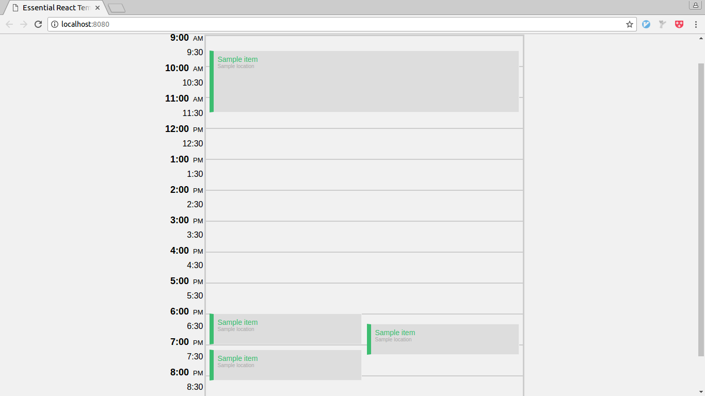
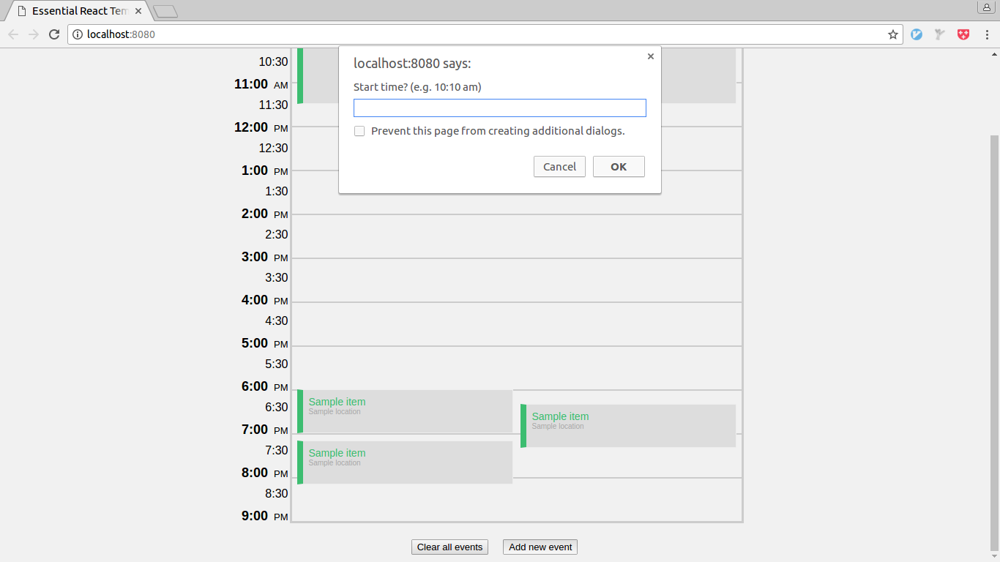
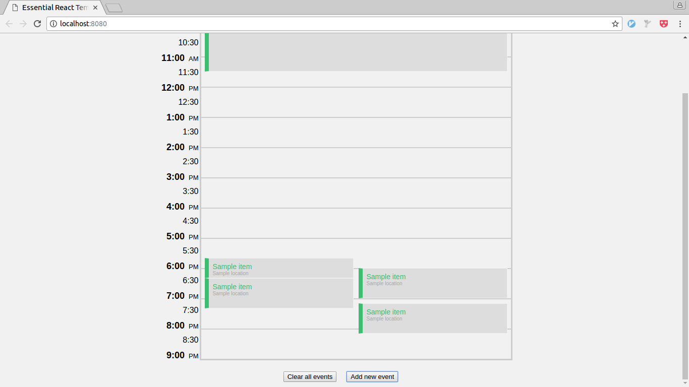

# How to run?
- `yarn`
- `yarn start`
- open up <http://localhost:8080> in your browser

# How to run unit tests?
- `yarn` (if haven't already)
- `yarn test`

# How to modify calendar events?
Use the "Clear all events" and "Add new event" buttons on the bottom.

# Screenshots

